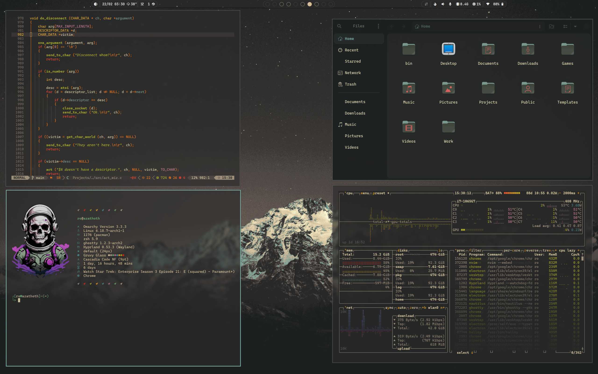

# Gruvbox Dark Inspired Theme

An Omarchy Theme for your Arch Linux / Hyprland setup based Gruvbox Dark. Recommend using the Gruvbox Dark GTK4.0 theme available on gnome-look.org and the included Gruvbox Dark oomox icon set included with this theme as well as the waybar theme which is a modification of [HANCORE](https://github.com/HANCORE-linux)'s 'V1.3ac' waybar theme. Waybar theme is found in the waybar-theme folder.

Waybar themes can be easily managed by '[Wayflipper](https://github.com/OldJobobo/wayflipper)' by OldJobobo

# Installation

To install this theme, simply use the ``omarchy-theme-install``   

command: `` omarchy-theme-install https://github.com/signaldirective/gruvy-glass ``  

  

**Theme by Signal Directive**
**Additional Credits:** HANCORE for Waybar theme, the Themix Project for icons, Costeer for the Discord theme CSS.